# Crescer juntos
## Descrição
Aplicação web do programa de apadrinhamento dos alunos do Projeto Alvo Certo, programa da Instituição Solidare.

## 📎Links importantes

  
  

## Tecnologias usadas
- **Backend:** Python (Django)
- **Frontend:** HTML e CSS

## 👥 Equipe de Desenvolvimento

👨‍💻 Rodrigo José Dantas de Oliveira - rjdo@cesar.school - CC

👨‍💻 Leandro Veras Padilha Filho - lvpf@cesar.school - CC

👨‍💻 Artur Antunes de Souza - aas4@cesar.school - CC

👨‍💻 Gustavo Pedrosa - gpm@cesar.school - CC

👨‍💻 Cassiano Filho - crdmcf@cesar.school - CC

👨‍💻 Marco Antonio Veras - mavss@cesar.school - CC

👨‍💻 Ricardo Machado -  rmvl@cesar.school - CC

👨‍💻 Thiago Alves -  tam7@cesar.school - CC

👨‍💻 Júlia Ferreira -   jvf@cesar.school - CC

👨‍💻 João Pedro Braga - jpvscb@cesar.school -Design

👨‍💻 Karina Bandeira - krb@cesar.school - Design

👨‍💻 Maria Fernanda Avellar - mfaa@cesar.school - Design
 

## Entregas 

  
✅Status report 1

   
   ## Histórias implementadas
   ### História  nº 1: Cadastrar apadrinhados.
   
   Como administrador do sistema,quero poder cadastrar novos apadrinhados preenchendo informações obrigatórias,Para que eles sejam incluídos corretamente na lista de apadrinhados e possam ser acompanhados pelos colaboradores.
 
   **Cenario 1** :
   **Dado** que o administrador preenche todos os campos obrigatórios corretamente (ex: nome, data de nascimento, gênero,etc.)
    
   **Quando** ele clicar em "Cadastrar"
    
   **Então** o sistema deve salvar o novo apadrinhado com sucesso, exibir uma mensagem de confirmação: “Apadrinhado cadastrado com sucesso” e  redirecionar ou atualizar a lista de apadrinhados.
   
   **Cenario 2**:
   **Dado** que o administrador deixa campos obrigatórios em branco (ex:    nome e data de nascimento)
   
   **Quando** ele clicar em "Cadastrar"
    
   **Então** o sistema deve bloquear o envio do formulário
    e exibir mensagens de erro em destaque informando os campos faltantes (ex: “O campo Nome é obrigatório”).
   ### História nº 2: Apadrinhamento de alunos.

   Como colaborador da instituição,
    quero visualizar a lista de alunos disponíveis para apadrinhamento,
    para que eu possa escolher um aluno e iniciar o processo de apadrinhamento.

   **Cenario 1**:
   **Dado** que estou logado no sistema como colaborador,
   
   **Quando** acesso a funcionalidade de apadrinhamento,
   
   **Então** devo ver uma lista com todos os alunos disponíveis, exibindo nome, idade e status de apadrinhamento.

   **Cenario 2**:
   **Dado** que estou visualizando a lista de alunos disponíveis,
    
   **Quando** seleciono um aluno e clico em "Apadrinhar",
   
   **Então** o sistema deve registrar essa ação, atualizar o status do aluno para "Apadrinhado" e exibir uma confirmação para o colaborador.

   [Link para as Histórias](https://docs.google.com/document/d/1LhCymEJ4g4B4Pyp8Aw-aXz103KHfBuQ9wGO2JfETQUw/edit?tab=t.0)

   ## Screencast

   [Screencast do Crescer Juntos](https://youtu.be/zZW43oyfJPQ)

   ## Diagrama de atividades
   
   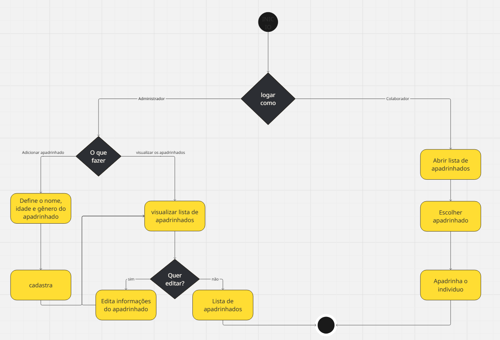

   ## Deployment

   [Deploy do site Crescer Juntos](https://crescer-juntos.azurewebsites.net/)
    
   ## Relatório programação em par

   [Relatório](https://docs.google.com/document/d/10dt_6UkQ73hmhbcdxdvz087hH_v_gVox6J6LYE2CLsk/edit?tab=t.0)

   ## Sketches/storyboards
   
   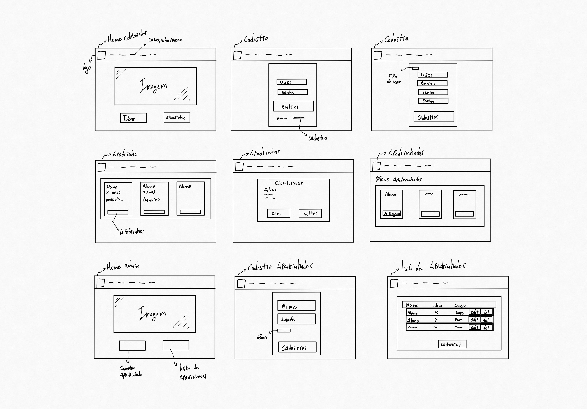

   ## Bugtracker
   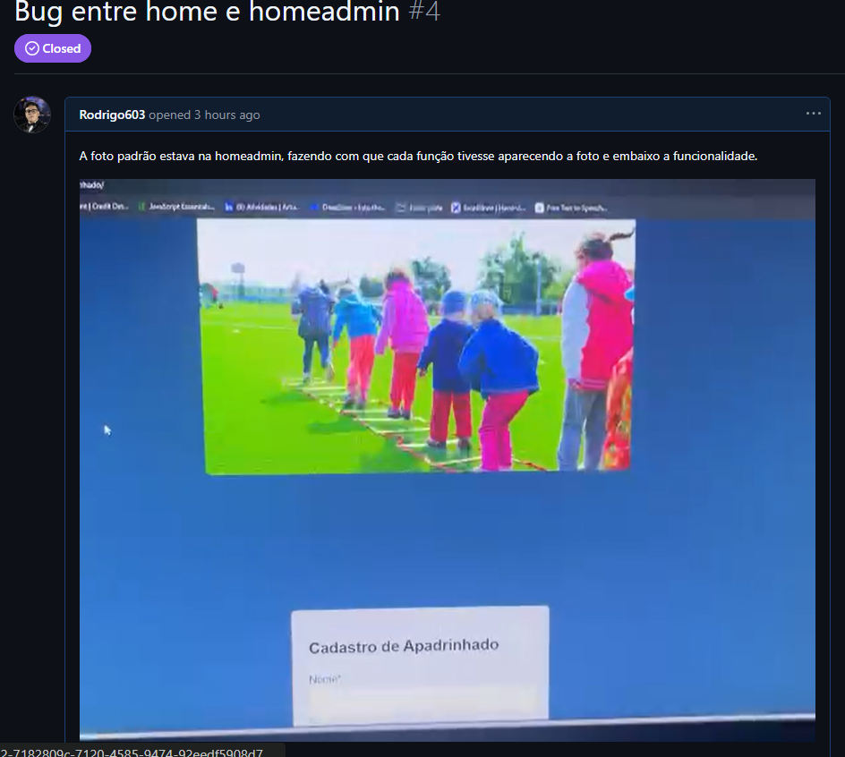

   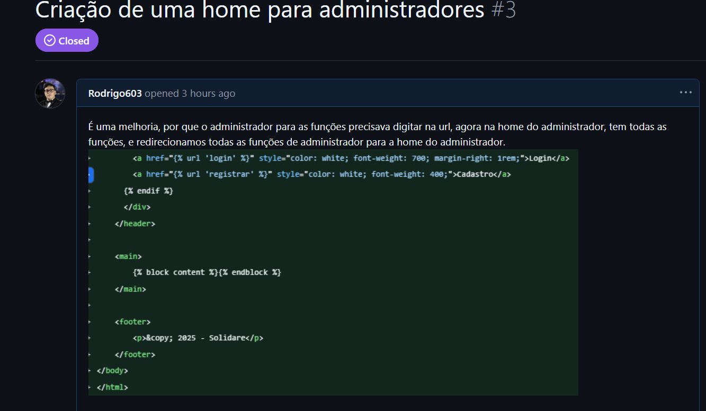

   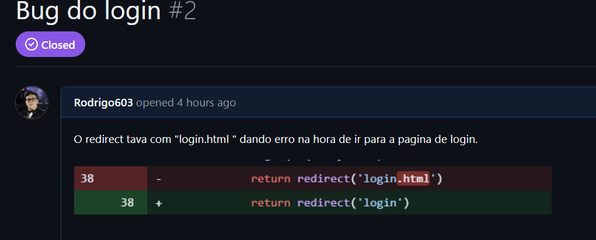

   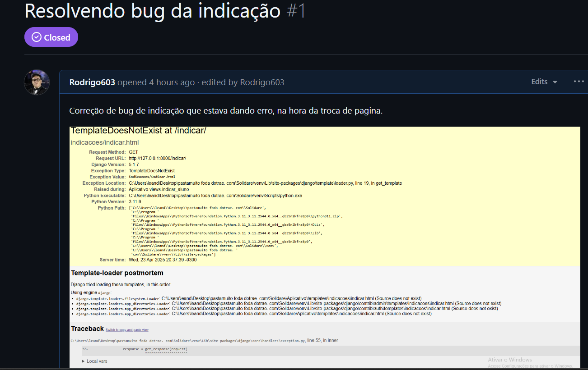

  
✅Status report 2

  ## Histórias implementadas

  ### História  nº 3: Realizar Doações

  Como colaborador, quero realizar doações financeiras ou materiais para ajudar o aluno apadrinhado, garantindo que minha contribuição será usada de forma transparente.
 
  **Cenario 1** :
  **Dado** que o colaborador acessa a página de doações,
  
  **Quando** ele seleciona um valor, escolhe um método de pagamento e confirma a transação,
  
  **Então** a doação deve ser processada com sucesso, e um comprovante deve ser gerado.
 
  **Cenario 2**:
  **Dado** que o colaborador fez uma doação para um aluno,
 
  **Quando** ele acessar o painel de contribuições,
  
  **Então** ele deve visualizar informações detalhadas sobre como sua doação foi utilizada (exemplo: material escolar comprado, taxa de matrícula  paga, etc.).
  **Cenario 3**:
  **Dado** que o colaborador tenta realizar uma doação,
 
  **Quando** houver falha na transação (como cartão inválido, saldo insuficiente ou erro no processamento do pagamento),
  
  **Então** o sistema deve exibir uma mensagem de erro informando o motivo da falha e sugerindo alternativas para completar a doação.
  
  ### História  nº 4: Visualizar doações(admin)
  
  Como admin gostaria de acompanhar as doações recebidas por cada aluno
  
  **Cenário 1:** Visualização bem sucedida
  
  **Dado que** o colaborador fez uma doação a um apadrinhado,
   
   **Quando** o administrador entrar na aba de doações,
   
   **Então** ele deve visualizar os dados das doações, qual colaborador doou, para quem, valor etc.

  **Cenário 2:** Visualização da aba de doações sem nenhuma feita
  
  **Dado que** o colaborador não fez nenhuma doação.
  
  **Quando** o administrador entrar na aba de doação
  
  **Então** ele verá a mensagem que ainda não foram feitas doações e a tabela vazia. 

  ### História nº 5: Gerenciamento do progresso dos alunos

  Como administrador quero gerenciar e atualizar os progressos dos alunos para que o colaborador esteja ciente de como está o apadrinhado.

  **Cenário 1:** Atualização de progresso bem-sucedida

  **Dado que** estou logado no sistema como administrador e já tenham apadrinhados cadastrados,

  **Quando** acesso a página de apadrinhados,

  **Então** devo conseguir editar e atualizar os dados dos alunos como mês, nota, frequência, e comentários para tal aluno.

  **Cenário 2:** Tentativa de salvar com campos incompletos

  **Dado que** como administrador, eu esteja adicionando o progresso do aluno,

  **Quando** tentar concluir sem preencher todos os campos,

  **Então** o sistema deve me mostrar um aviso dizendo onde faltou ser preenchido.

  ### História nº 6: Acompanhar o Progresso do Aluno  
  
  Como colaborador, quero acompanhar o desempenho acadêmico e a evolução do aluno apadrinhado para entender melhor suas dificuldades e avanços. 
  
  **Cenário 1:** Consulta ao boletim do aluno 

  **Dado que** o colaborador acessa a plataforma, 

  **Quando** ele entrar na página do aluno apadrinhado, 

  **Então** ele deve visualizar as notas, frequência e comentários dos professores sobre o desempenho do aluno  

  **Cenário 2:** Relatórios de progresso personalizados 

  **Dado que** o colaborador deseja acompanhar detalhes específicos do progresso do aluno,  

  **Quando** ele acessar a seção de progresso do aluno, 

  **Então** o sistema deve permitir a aplicação de filtros para visualizar diferentes métricas (como notas, frequência e feedbacks dos professores) separadamente, de acordo com o  interesse do colaborador.

  ### História nº 7: Mensagens entre o colaborador e administrador sobre apadrinhado

  Como padrinho, quero mandar mensagens para o administrador sobre o meu apadrinhado.

  **Cenário 1:** Colaborador conseguindo se comunicar com o administrador

  **Dado que** o colaborador entre na aba de mensagens e escolha o apadrinhado,

  **Quando** o colaborador mandar a mensagem,

  **Então** o administrador poderá responder pela aba de mensagens e assim os dois vão poder se comunicar pelo site.
  
  ### História nº 8: Agendar Visitas ao Aluno

  Como padrinho, quero agendar visitas presenciais ao meu afilhado para fortalecer nosso vínculo.

  **Cenário 1:** Agendamento bem-sucedido

  **Dado que** estou logado como padrinho e acesso a seção "Agendar Visita",

  **Quando** seleciono uma data disponível, preencho o horário e motivo da visita,

  **Então** o sistema deve confirmar o agendamento e enviar um e-mail para mim e para a instituição.

  **Cenário 2:** Administrador recusar a visita

  **Dado que** tenho uma visita agendada,

  **Quando** o administrador não puder receber o colaborador naquele dia e recusar o agendamento,

  **Então** quando o colaborador entrar na aba de visitas vai estar lá como cancelada.

  [Link para as Histórias](https://docs.google.com/document/d/1LhCymEJ4g4B4Pyp8Aw-aXz103KHfBuQ9wGO2JfETQUw/edit?tab=t.0)
  ## Screencasts

  [Screencast do Crescer Juntos](https://youtu.be/PkGEu5mDCf4)
  
  [CI/CD Crescer juntos](https://www.youtube.com/watch?v=Y310t7Hvnbw)
  
  [Testes automatizados Crescer juntos](https://www.youtube.com/watch?v=CnmwkWDG860)

  ## Diagrama de atividades
  História 1: Cadastro de apadrinhados(admin)
  
  

  História 2: Apadrinhamento(colaborador)
  
  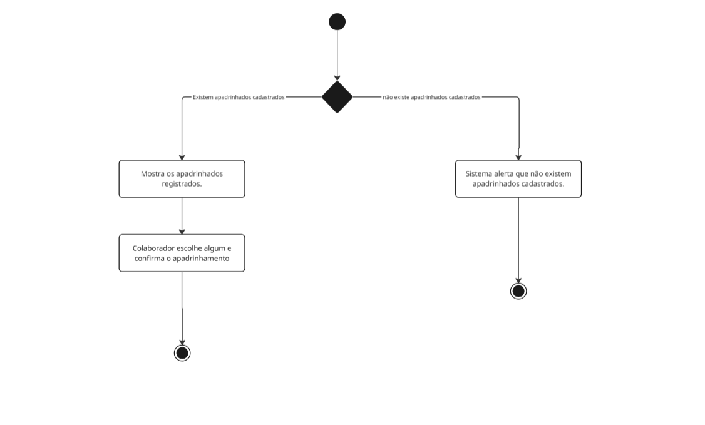 

  História 3: Fazer doação(colaborador)
  
  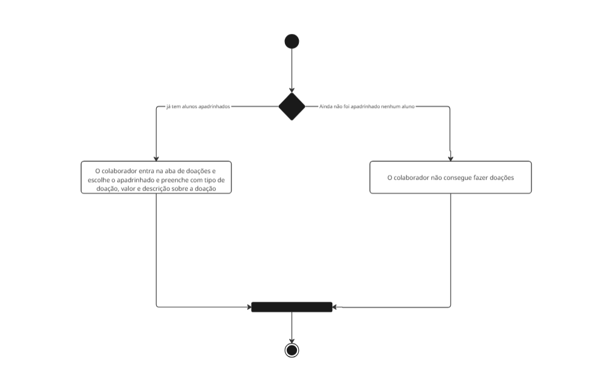

  História 4: Visualização das doações(admin)
  
  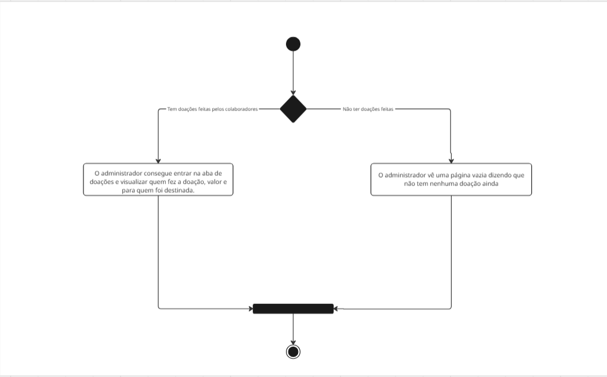

  História 5: Gerenciamento do progresso dos alunos(admin)
  
  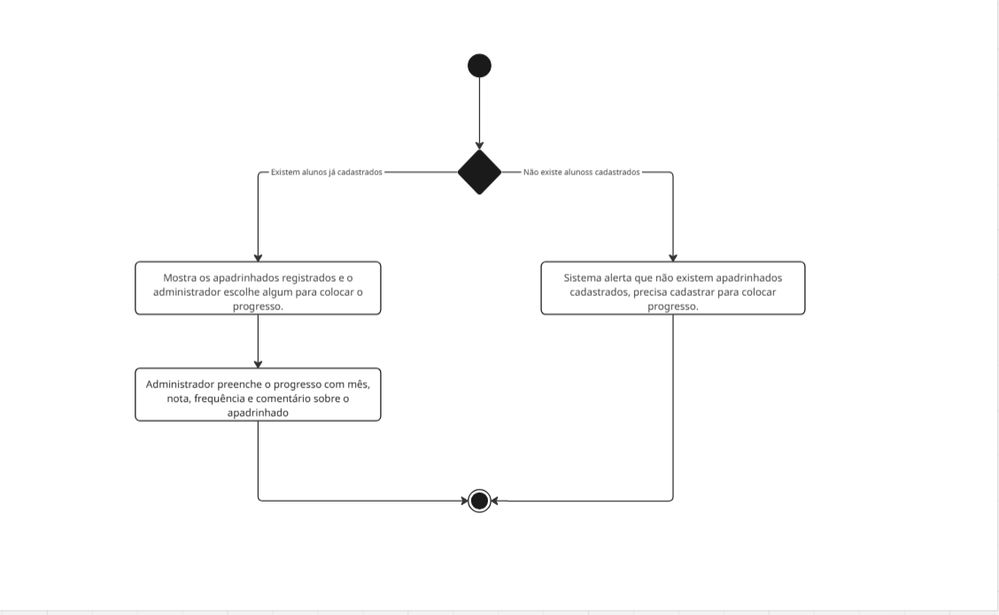

  História 6: Visualização do progresso(colaborador)
  
  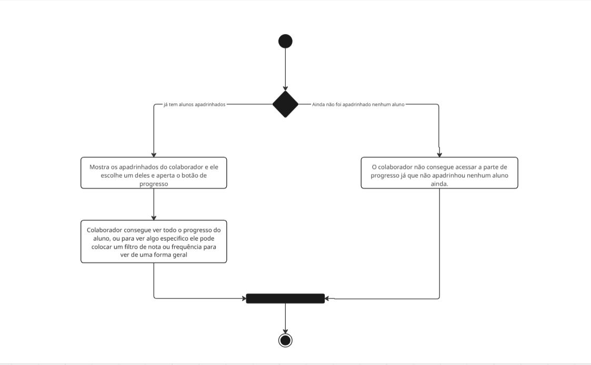

  História 7: Mensagens entre colaborador e administrador
  
  

  História 8: Agendar visita à apadrinhado(colaborador)
  
  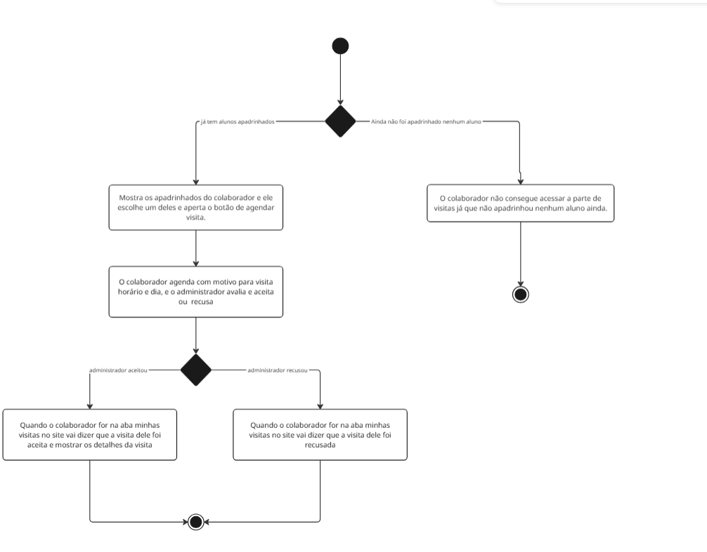

  ## Deployment
  [Deploy do site Crescer Juntos](https://crescer-juntos.azurewebsites.net/)
   
  ## Relatório programação em par
  [Relatório](https://docs.google.com/document/d/10dt_6UkQ73hmhbcdxdvz087hH_v_gVox6J6LYE2CLsk/edit?tab=t.0)
  ## Sketches/storyboards

  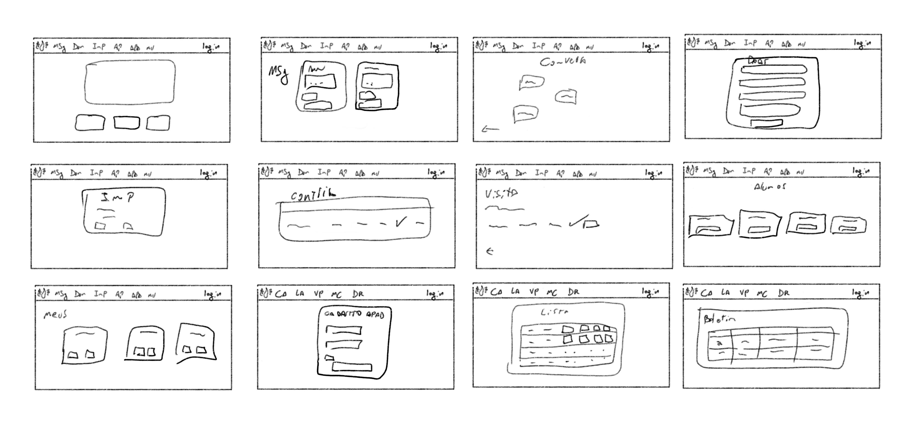
  
  ## Bugtracker
  
  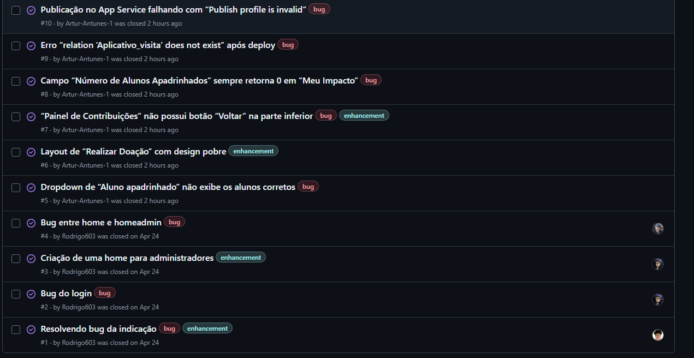